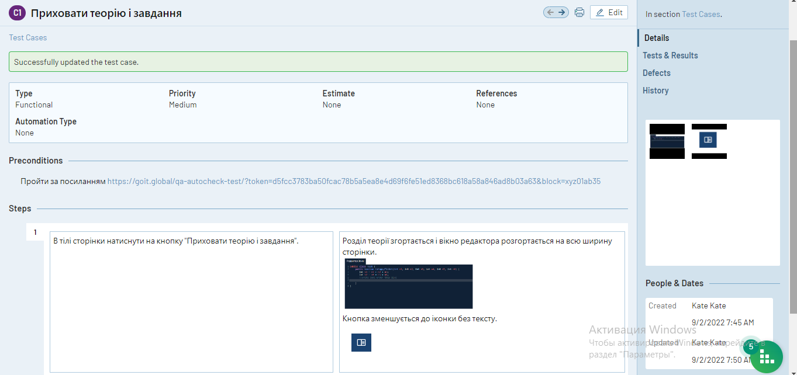

### Практична робота з Test Rail

Приклади 5 Test Case на п'ять будь-яких функцій. P.S. Кожен Step має бути Expected Result.

*Приховати теорію і завдання*

*Посилання на головний сайт*

*Навігаційне меню*

*Локалізація*

*Політика конфіденційності*

