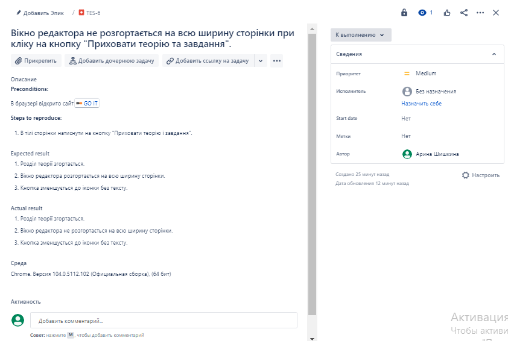

### Практична робота з оформлення баг-репортів (Test Run, Jira)

*Test Run*

Приклади 3 Bug Report. 

*Модальне вікно про політику конфіденційності не містить інформацію (пусте).*

*Не працює зміна мови сайту на російську.*

*Вікно редактора не розгортається на всю ширину сторінки при кліку на кнопку "Приховати теорію та завдання".*

