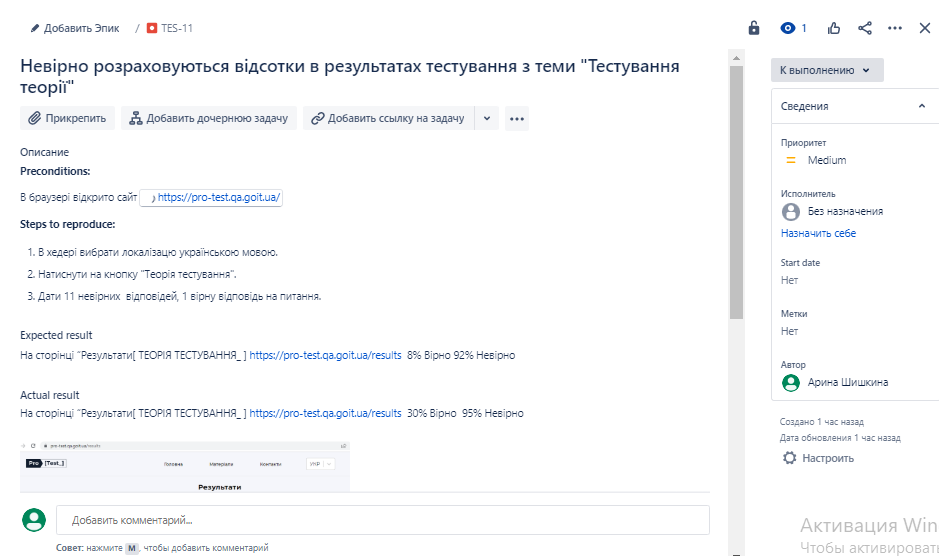
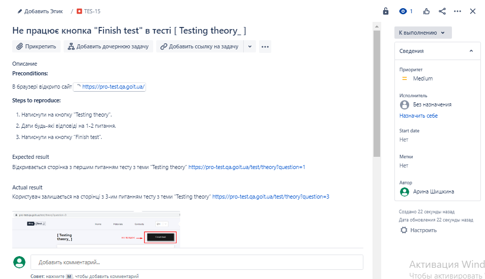
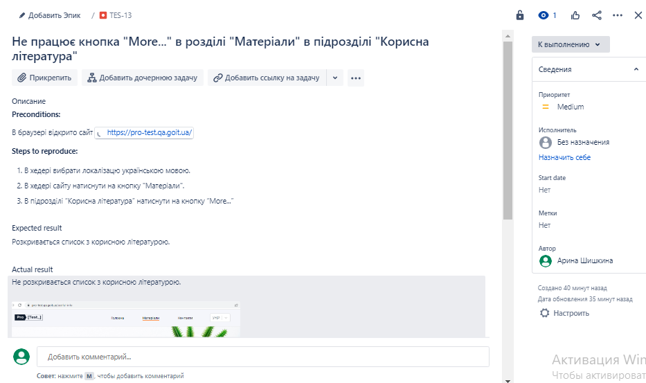
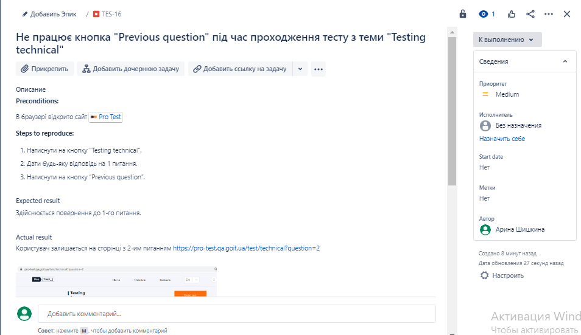
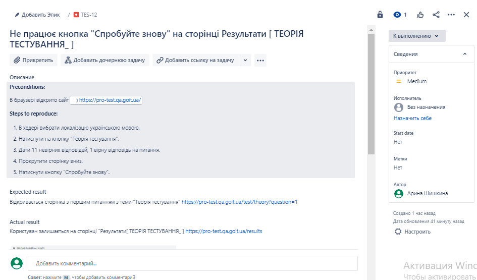

### Практична робота з оформлення багів, отриманних від користувачів (Jira)

Приклади 5 Bug Report. 

*Невірно розраховуються відсотки в результатах тестування з теми "Тестування теорії"*

*Не працює кнопка "Finish test" в тесті [ Testing theory_ ]*

*Не працює кнопка "More..." в розділі "Матеріали" в підрозділі "Корисна література"*

*Не працює кнопка "Previous question" під час проходження тесту з теми "Testing technical"*

*Не працює кнопка "Спробуйте знову" на сторінці Результати [ ТЕОРІЯ ТЕСТУВАННЯ_ ]*

